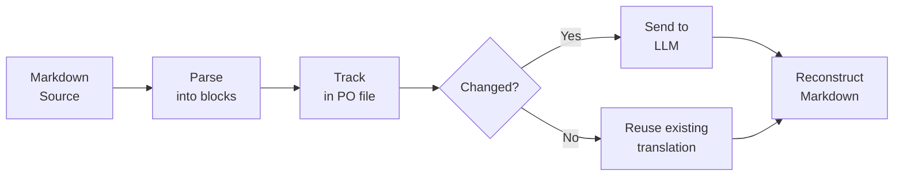

# mdpo-llm

[](https://pypi.org/project/mdpo-llm/)
[](https://pypi.org/project/mdpo-llm/)
[]()
[](https://github.com/willysk73/mdpo-llm/blob/main/LICENSE)

**Translate Markdown with LLMs — and only pay for what changed.**

mdpo-llm splits your Markdown into blocks, tracks each one in a PO file, and sends only new or changed blocks to your LLM. Edit one paragraph in a 50-block document? One API call, not fifty.

## How It Works



Each block (heading, paragraph, code block, list, table) is tracked independently. On subsequent runs, only blocks whose source text changed get sent to the LLM — the rest are served from the PO cache.

### Incremental processing in practice

```
First run:    8 blocks parsed → 8 API calls → full document translated
Edit source:  change 1 paragraph
Second run:   8 blocks parsed → 1 API call  → only the changed block retranslated
```

## Translation Context

Blocks aren't translated in isolation. As each block is translated, it's added to a reference pool. Subsequent blocks receive the most similar previous translations as few-shot examples, so the LLM maintains consistent tone, terminology, and style across the entire document.

```
Block 1: "Introduction"     → translated (no context yet)
Block 2: "Getting Started"  → translated with Block 1 as reference
Block 3: "Installation"     → translated with Blocks 1–2 as reference
...
```

On re-runs, the pool is seeded from all existing translations in the PO file, so even a single changed paragraph benefits from the full document's context.

## Installation

```bash
pip install mdpo-llm
```

## Quick Start

### 1. Implement the LLM interface

One method. Any provider.

```python
from mdpo_llm import LLMInterface, MdpoLLM

class MyLLM(LLMInterface):
    def process(self, source_text: str, reference_pairs=None, target_lang=None) -> str:
        language = target_lang or "Korean"
        messages = [
            {"role": "system", "content": f"Translate to {language}."},
        ]
        # Use reference pairs as few-shot examples for consistency
        if reference_pairs:
            for src, tgt in reference_pairs:
                messages.append({"role": "user", "content": src})
                messages.append({"role": "assistant", "content": tgt})
        messages.append({"role": "user", "content": source_text})

        response = openai.chat.completions.create(
            model="gpt-4", messages=messages,
        )
        return response.choices[0].message.content
```

> Both `reference_pairs` and `target_lang` are optional. If your `process()` method doesn't include either parameter, mdpo-llm detects this automatically and calls without it. Existing implementations won't break.

### 2. Process a document

```python
from pathlib import Path

processor = MdpoLLM(
    MyLLM(),
    target_lang="ko",        # forwarded to LLM's process() as target_lang
    source_langs=["ko"],     # code blocks without Korean are skipped
)

result = processor.process_document(
    source_path=Path("docs/README.md"),
    target_path=Path("docs/README_ko.md"),
    po_path=Path("translations/README.po"),
)

print(f"Processed {result['translation_stats']['processed']} blocks")
print(f"Coverage: {result['coverage']['coverage_percentage']}%")
```

Run it again after editing the source — only the changed paragraphs get reprocessed.

### 3. Process a directory

```python
result = processor.process_directory(
    source_dir=Path("docs/"),
    target_dir=Path("docs_ko/"),
    po_dir=Path("translations/"),
    glob="**/*.md",
    max_workers=4,  # files processed concurrently
)

print(f"{result['files_processed']} files processed")
print(f"{result['files_skipped']} files unchanged")
```

The directory structure is mirrored into `target_dir` and `po_dir`. Each file gets its own PO file and its own reference pool.

## Language Handling

### `target_lang` — tell the LLM which language to produce

A BCP 47 locale string (e.g. `"ko"`, `"ja"`, `"zh-CN"`) passed through to your LLM's `process()` method. The source language is auto-detected by the LLM — you only specify the target.

```python
processor = MdpoLLM(MyLLM(), target_lang="ja")
```

When `target_lang` is set, new PO files will include a `Language` header (e.g. `Language: ja`).

### `source_langs` — control code block skipping

A list of BCP 47 locale strings. Code blocks that don't contain any of these languages are skipped (copied as-is). This prevents pure-English code from being sent to the LLM unnecessarily.

```python
# Skip code blocks that don't contain Korean or Chinese
processor = MdpoLLM(MyLLM(), source_langs=["ko", "zh"])
```

When `source_langs` is `None` (the default), code block skipping is disabled and all code blocks are sent to the LLM.

### Supported locale codes

| Code | Language |
|------|----------|
| `en` | English |
| `zh` | Chinese |
| `ja` | Japanese |
| `ko` | Korean |

Region subtags (e.g. `zh-CN`, `zh-TW`) are accepted — only the primary subtag is used for detection.

## Comparison

| | mdpo-llm | mdpo | md-translator | llm-translator |
|---|:---:|:---:|:---:|:---:|
| LLM-powered | Yes | No | Yes | Yes |
| Incremental (block-level) | Yes | Yes | No | No |
| PO file tracking | Yes | Yes | No | No |
| Translation context (few-shot) | Yes | No | Partial | No |
| LLM-agnostic | Yes | — | Multi-provider | OpenAI only |
| Batch directory processing | Yes | Yes | No | No |

**mdpo** pioneered PO-based Markdown translation but targets manual/MT workflows, not LLMs. **md-translator** and **llm-translator** use LLMs but reprocess entire files on every run. mdpo-llm combines both: PO-tracked incremental processing with LLM-powered translation and cross-block context.

## API Reference

### MdpoLLM

Constructor:

```python
MdpoLLM(
    llm_interface,             # your LLMInterface implementation
    max_reference_pairs=5,     # max similar pairs passed as context
    target_lang=None,          # BCP 47 string forwarded to LLM
    source_langs=None,         # list of BCP 47 strings for code block skipping
)
```

| Method | Description |
|--------|-------------|
| `process_document(source_path, target_path, po_path, inplace=False)` | Process a single Markdown file |
| `process_directory(source_dir, target_dir, po_dir, glob, inplace, max_workers)` | Process a directory tree concurrently |
| `get_translation_stats(source_path, po_path)` | Return coverage and block statistics |
| `export_report(source_path, po_path)` | Generate a detailed text report |

### LLMInterface

Abstract base class. Implement one method:

```python
class LLMInterface(ABC):
    @abstractmethod
    def process(self, source_text: str) -> str: ...
```

Optionally accept `reference_pairs` and/or `target_lang`:

```python
def process(self, source_text: str, reference_pairs=None, target_lang=None) -> str: ...
```

The processor detects these parameters via `inspect.signature` and passes them only when present — no breaking changes to existing implementations.

## Working with PO Files

PO files (GNU gettext) track the state of each content block:

- **Untranslated** — new content, will be sent to the LLM
- **Translated** — completed, reused on subsequent runs
- **Fuzzy** — source changed since last run, will be retranslated
- **Obsolete** — source block was removed, cleaned up automatically

You can inspect and edit PO files with any standard gettext tool (Poedit, Lokalize, etc.).

When `target_lang` is set, new PO files include a `Language` metadata header so tools can identify the target language.

## Development

```bash
# Install with dev dependencies
uv pip install -e ".[dev]"

# Run tests
pytest tests/
```

## License

MIT
