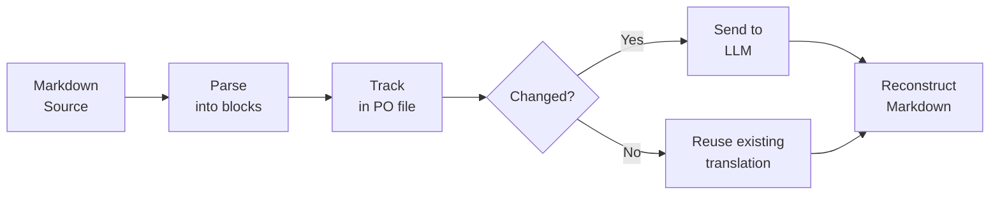

# mdpo-llm

[](https://pypi.org/project/mdpo-llm/)
[](https://pypi.org/project/mdpo-llm/)
[]()
[](https://github.com/willysk73/mdpo-llm/blob/main/LICENSE)

**Translate Markdown with LLMs — and only pay for what changed.**

mdpo-llm splits your Markdown into blocks, tracks each one in a PO file, and sends only new or changed blocks to your LLM. Edit one paragraph in a 50-block document? One API call, not fifty.

## How It Works



Each block (heading, paragraph, code block, list, table) is tracked independently. On subsequent runs, only blocks whose source text changed get sent to the LLM — the rest are served from the PO cache.

### Incremental processing in practice

```
First run:    8 blocks parsed → 8 API calls → full document translated
Edit source:  change 1 paragraph
Second run:   8 blocks parsed → 1 API call  → only the changed block retranslated
```

## Translation Context

Blocks aren't translated in isolation. As each block is translated, it's added to a reference pool. Subsequent blocks receive the most similar previous translations as few-shot examples, so the LLM maintains consistent tone, terminology, and style across the entire document.

```
Block 1: "Introduction"     → translated (no context yet)
Block 2: "Getting Started"  → translated with Block 1 as reference
Block 3: "Installation"     → translated with Blocks 1–2 as reference
...
```

On re-runs, the pool is seeded from all existing translations in the PO file, so even a single changed paragraph benefits from the full document's context.

## Installation

```bash
pip install mdpo-llm
```

## Quick Start

### 1. Translate a document

No subclassing, no boilerplate. Pass a model string and go.

```python
from pathlib import Path
from mdpo_llm import MdpoLLM

processor = MdpoLLM(
    model="gpt-4",            # any LiteLLM model string
    target_lang="ko",         # baked into the system prompt
    temperature=0.3,          # forwarded to litellm.completion()
)

result = processor.process_document(
    source_path=Path("docs/README.md"),
    target_path=Path("docs/README_ko.md"),
    # po_path defaults to docs/README_ko.po
)

print(f"Processed {result['translation_stats']['processed']} blocks")
print(f"Coverage: {result['coverage']['coverage_percentage']}%")
```

Run it again after editing the source — only the changed paragraphs get reprocessed.

### 2. Process a directory

```python
result = processor.process_directory(
    source_dir=Path("docs/"),
    target_dir=Path("docs_ko/"),
    glob="**/*.md",
    max_workers=4,  # files processed concurrently
    # po_dir defaults to target_dir (PO files next to translated files)
)

print(f"{result['files_processed']} files processed")
print(f"{result['files_skipped']} files unchanged")
```

The directory structure is mirrored into `target_dir`. Each file gets its own PO file and its own reference pool. By default, PO files are placed next to the target files; pass `po_dir` to store them separately.

### 3. Use any provider

LiteLLM supports 100+ providers. Just change the model string:

```python
# OpenAI
MdpoLLM(model="gpt-4", target_lang="ko")

# Anthropic
MdpoLLM(model="anthropic/claude-sonnet-4-5-20250929", target_lang="ko")

# Google
MdpoLLM(model="gemini/gemini-pro", target_lang="ko")

# Azure OpenAI
MdpoLLM(model="azure/my-deployment", target_lang="ko", api_base="https://...")
```

## Language Handling

### `target_lang` — tell the LLM which language to produce

A BCP 47 locale string (e.g. `"ko"`, `"ja"`, `"zh-CN"`) baked into the system prompt. The source language is auto-detected by the LLM — you only specify the target.

```python
processor = MdpoLLM(model="gpt-4", target_lang="ja")
```

When `target_lang` is set, new PO files will include a `Language` header (e.g. `Language: ja`).

## Glossary

Protect brand names, trademarks, and proper nouns from translation — or force specific translations for them.

### Inline glossary

```python
processor = MdpoLLM(
    model="gpt-4",
    target_lang="ko",
    glossary={
        "GitHub": None,                # None = do not translate
        "Markdown": None,
        "pull request": "풀 리퀘스트",  # force specific translation
        "API": "API",
    },
)
```

### JSON glossary file

For multi-locale projects, keep a single `glossary.json`:

```json
{
  "GitHub": null,
  "Markdown": null,
  "pull request": {
    "ko": "풀 리퀘스트",
    "ja": "プルリクエスト"
  },
  "API": "API"
}
```

- `null` — do not translate (any locale)
- `"string"` — use this translation for all locales
- `{"ko": "...", "ja": "..."}` — per-locale; if the current locale isn't listed, the term is kept as-is

```python
processor = MdpoLLM(
    model="gpt-4",
    target_lang="ko",
    glossary_path="glossary.json",
)
```

If both `glossary` and `glossary_path` are provided, inline entries override the file.

Only glossary terms that actually appear in each block are injected into the prompt, so a large glossary doesn't waste tokens on irrelevant blocks.

See [`examples/glossary.json`](examples/glossary.json) for a full example with brand names, technical terms, and per-locale translations.

## Comparison

| | mdpo-llm | mdpo | md-translator | llm-translator |
|---|:---:|:---:|:---:|:---:|
| LLM-powered | Yes | No | Yes | Yes |
| Incremental (block-level) | Yes | Yes | No | No |
| PO file tracking | Yes | Yes | No | No |
| Translation context (few-shot) | Yes | No | Partial | No |
| LLM-agnostic | Yes | — | Multi-provider | OpenAI only |
| Batch directory processing | Yes | Yes | No | No |

**mdpo** pioneered PO-based Markdown translation but targets manual/MT workflows, not LLMs. **md-translator** and **llm-translator** use LLMs but reprocess entire files on every run. mdpo-llm combines both: PO-tracked incremental processing with LLM-powered translation and cross-block context.

## API Reference

### MdpoLLM

Constructor:

```python
MdpoLLM(
    model,                     # any LiteLLM model string (required)
    target_lang,               # BCP 47 string, baked into system prompt (required)
    max_reference_pairs=5,     # max similar pairs passed as few-shot context
    extra_instructions=None,   # appended to the built-in translation prompt
    post_process=None,         # Callable[[str], str] applied to every LLM response
    glossary=None,             # dict[str, str | None] — inline glossary
    glossary_path=None,        # path to JSON glossary file (multi-locale)
    **litellm_kwargs,          # temperature, api_key, api_base, etc.
)
```

| Method | Description |
|--------|-------------|
| `process_document(source_path, target_path, po_path=None, inplace=False)` | Process a single Markdown file. `po_path` defaults to `target_path` with `.po` extension. |
| `process_directory(source_dir, target_dir, po_dir=None, glob, inplace, max_workers)` | Process a directory tree concurrently. `po_dir` defaults to `target_dir`. |
| `get_translation_stats(source_path, po_path)` | Return coverage and block statistics |
| `export_report(source_path, po_path)` | Generate a detailed text report |

### Prompts

The `Prompts` class exposes all built-in prompt templates used by the processor:

```python
from mdpo_llm import Prompts

# See the default translation instruction
print(Prompts.TRANSLATE_INSTRUCTION)
```

## Working with PO Files

PO files (GNU gettext) track the state of each content block:

- **Untranslated** — new content, will be sent to the LLM
- **Translated** — completed, reused on subsequent runs
- **Fuzzy** — source changed since last run, will be retranslated
- **Obsolete** — source block was removed, cleaned up automatically

You can inspect and edit PO files with any standard gettext tool (Poedit, Lokalize, etc.).

When `target_lang` is set, new PO files include a `Language` metadata header so tools can identify the target language.

## Development

```bash
# Install with dev dependencies
uv pip install -e ".[dev]"

# Run tests
pytest tests/
```

## License

MIT
