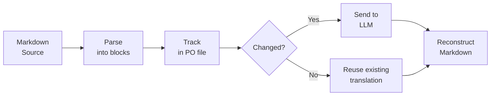

# mdpo-llm

[](https://pypi.org/project/mdpo-llm/)
[](https://pypi.org/project/mdpo-llm/)
[]()
[](https://github.com/willysk73/mdpo-llm/blob/main/LICENSE)

**Translate Markdown with LLMs — and only pay for what changed.**

mdpo-llm splits your Markdown into blocks, tracks each one in a PO file, and sends only new or changed blocks to your LLM. Edit one paragraph in a 50-block document? One API call, not fifty.

## What's new in v0.3

- **Batched JSON-mode translation** (default on). A 50-block first-run collapses from 50 serial calls to ~2 batched calls.
- **Intra-document consistency by construction** — sibling blocks share one LLM context, so tone and terminology unify across a document.
- **Post-translation validator** (opt-in via `validation="conservative"` or `"strict"`) checks heading levels, fence counts, glossary preservation, and target-language presence.
- **Prompt caching** hint on the stable system prefix — pass `enable_prompt_cache=True` to cut cost on re-runs and large directory jobs.
- **CLI** — `python -m mdpo_llm translate|translate-dir|estimate|report …`.
- **Typed result dataclasses** (`ProcessResult`, `Coverage`, `BatchStats`) with dict-style access for backward compatibility.
- **Dry-run estimator** — `processor.estimate(src)` reports pending blocks and estimated tokens with zero API calls.
- **Per-run receipt** — every `translate` / `translate-dir` run attaches a `Receipt` with total tokens, per-1M USD pricing, wall-clock duration, and API-call count. CLI prints a human-readable block to stderr; `--json-receipt PATH` dumps the same data as JSON for CI.
- **Progress display** — `translate` / `translate-dir` render a live `rich` progress bar on a TTY (batches for a single file, file count for a directory). Auto-suppressed under `-v`, when stderr isn't a TTY, when `MDPO_NO_PROGRESS` is set, or via `--no-progress`. The library stays UI-agnostic: pass `progress_callback=` to `MdpoLLM(...)` to receive `ProgressEvent` dataclasses and render your own UI.

v0.2 behaviour (one call per block) is preserved via `batch_size=0`.

## How It Works


```mermaid
flowchart LR
    A["Markdown\nSource"] --> B["Parse\ninto blocks"]
    B --> C["Track\nin PO file"]
    C --> D{"Changed?"}
    D -- Yes --> E["Send to\nLLM"]
    D -- No --> F["Reuse existing\ntranslation"]
    E --> G["Reconstruct\nMarkdown"]
    F --> G
```

Each block (heading, paragraph, code block, list, table) is tracked independently. On subsequent runs, only blocks whose source text changed get sent to the LLM — the rest are served from the PO cache.

### Incremental processing in practice

```
First run:    8 blocks parsed → 8 API calls → full document translated
Edit source:  change 1 paragraph
Second run:   8 blocks parsed → 1 API call  → only the changed block retranslated
```

## Translation Context

Blocks aren't translated in isolation. As each block is translated, it's added to a reference pool. Subsequent blocks receive the most similar previous translations as few-shot examples, so the LLM maintains consistent tone, terminology, and style across the entire document.

```
Block 1: "Introduction"     → translated (no context yet)
Block 2: "Getting Started"  → translated with Block 1 as reference
Block 3: "Installation"     → translated with Blocks 1–2 as reference
...
```

On re-runs, the pool is seeded from all existing translations in the PO file, so even a single changed paragraph benefits from the full document's context.

## Installation

```bash
pip install mdpo-llm
```

## Quick Start

### 1. Translate a document

No subclassing, no boilerplate. Pass a model string and go.

```python
from pathlib import Path
from mdpo_llm import MdpoLLM

processor = MdpoLLM(
    model="gpt-4",            # any LiteLLM model string
    target_lang="ko",         # baked into the system prompt
    temperature=0.3,          # forwarded to litellm.completion()
)

result = processor.process_document(
    source_path=Path("docs/README.md"),
    target_path=Path("docs/README_ko.md"),
    # po_path defaults to docs/README_ko.po
)

print(f"Processed {result['translation_stats']['processed']} blocks")
print(f"Coverage: {result['coverage']['coverage_percentage']}%")
```

Run it again after editing the source — only the changed paragraphs get reprocessed.

### 2. Process a directory

```python
result = processor.process_directory(
    source_dir=Path("docs/"),
    target_dir=Path("docs_ko/"),
    glob="**/*.md",
    max_workers=4,  # files processed concurrently
    # po_dir defaults to target_dir (PO files next to translated files)
)

print(f"{result['files_processed']} files processed")
print(f"{result['files_skipped']} files unchanged")
```

The directory structure is mirrored into `target_dir`. Each file gets its own PO file and its own reference pool. By default, PO files are placed next to the target files; pass `po_dir` to store them separately.

#### Optional: translate filenames too (`--translate-paths`)

By default `process_directory` mirrors the source tree 1:1, so a document at `docs/guide/intro.md` ends up at `docs_ko/guide/intro.md`. Opting into `--translate-paths` (CLI) or `translate_paths=True` (API) additionally translates the filesystem path segments themselves — directory names and markdown file stems — so the target tree uses localized filenames:

```bash
python -m mdpo_llm translate-dir docs/ docs_ko/ \
    --model gpt-4o \
    --target ko \
    --po-dir po/ \
    --translate-paths
```

What this produces:

- **`_paths.po`** — a dedicated catalog under `--po-dir` (or `target_dir` when `--po-dir` is omitted) that stores one entry per distinct source segment. Segment translations flow through the same LLM pipeline as content blocks, so caching, glossary configuration, and token receipts behave the same way. Re-running the command hits cache on unchanged segments and spends zero API calls on them.
- **`path_map.json`** — a JSON map `{ "source/relative.md": "translated/relative.md", ... }` written at the root of the translated tree. Downstream tooling (link rewriters, sitemap generators, CI jobs) can read this file to resolve the source ↔ target pairing without re-running the translator.
- **Sanitized, deterministic slugs** — LLM output is NFC-normalised, whitespace is collapsed, and characters reserved on Windows / POSIX filesystems (`/\\<>:"|?*` plus control bytes) are stripped. If two sibling source files end up with the same translated slug, `-2` / `-3` disambiguators are appended in alphabetical source order so the output is reproducible. File extensions are preserved verbatim. Dotfile segments (`.github`, `.well-known`) pass through unchanged so CI and web-infrastructure paths don't silently break.
- **PO files stay keyed on the SOURCE path.** Per-file `.po` outputs under `--po-dir` are still laid out using the source-relative path, so incremental re-runs hit the same PO cache even when the target filename moves between runs.

What it explicitly does NOT do:

- **Link rewriting is out of scope.** Markdown link text and URLs inside translated content are not modified — auto-rewriting them would invalidate every document's internal anchors and cross-references. `path_map.json` is published so downstream tooling can do that rewrite deterministically in a subsequent pass.

### 3. Use any provider

LiteLLM supports 100+ providers. Just change the model string:

```python
# OpenAI
MdpoLLM(model="gpt-4", target_lang="ko")

# Anthropic
MdpoLLM(model="anthropic/claude-sonnet-4-5-20250929", target_lang="ko")

# Google
MdpoLLM(model="gemini/gemini-pro", target_lang="ko")

# Azure OpenAI
MdpoLLM(model="azure/my-deployment", target_lang="ko", api_base="https://...")
```

## Language Handling

### `target_lang` — tell the LLM which language to produce

A BCP 47 locale string (e.g. `"ko"`, `"ja"`, `"zh-CN"`) baked into the system prompt. The source language is auto-detected by the LLM — you only specify the target.

```python
processor = MdpoLLM(model="gpt-4", target_lang="ja")
```

When `target_lang` is set, new PO files will include a `Language` header (e.g. `Language: ja`).

## Glossary

Protect brand names, trademarks, and proper nouns from translation — or force specific translations for them.

### Inline glossary

```python
processor = MdpoLLM(
    model="gpt-4",
    target_lang="ko",
    glossary={
        "GitHub": None,                # None = do not translate
        "Markdown": None,
        "pull request": "풀 리퀘스트",  # force specific translation
        "API": "API",
    },
)
```

### JSON glossary file

For multi-locale projects, keep a single `glossary.json`:

```json
{
  "GitHub": null,
  "Markdown": null,
  "pull request": {
    "ko": "풀 리퀘스트",
    "ja": "プルリクエスト"
  },
  "API": "API"
}
```

- `null` — do not translate (any locale)
- `"string"` — use this translation for all locales
- `{"ko": "...", "ja": "..."}` — per-locale; if the current locale isn't listed, the term is kept as-is

```python
processor = MdpoLLM(
    model="gpt-4",
    target_lang="ko",
    glossary_path="glossary.json",
)
```

If both `glossary` and `glossary_path` are provided, inline entries override the file.

Only glossary terms that actually appear in each block are injected into the prompt, so a large glossary doesn't waste tokens on irrelevant blocks.

See [`examples/glossary.json`](examples/glossary.json) for a full example with brand names, technical terms, and per-locale translations.

### Glossary mode: `instruction` vs `placeholder`

`glossary_mode` (constructor kwarg, CLI `--glossary-mode`) controls how
glossary terms reach the model:

- `"placeholder"` (default): substitutes every glossary term with an
  opaque `⟦P:N⟧` token **before** the call and restores the target-
  language form (or the original term for do-not-translate entries)
  **after** the call. The model never sees the terms, so it cannot
  translate, renumber, or mangle them — and the round-trip check
  automatically flags any dropped token.
- `"instruction"`: appends a glossary block to the system prompt. The
  LLM sees the raw source text and is asked to preserve or translate
  each term as specified. Use this when your terms contain characters
  that `"placeholder"` cannot match (see caveats below).

```python
processor = MdpoLLM(
    model="gpt-4",
    target_lang="ko",
    glossary={"GitHub": None, "pull request": "풀 리퀘스트"},
    glossary_mode="placeholder",
)
```

Matching is **case-sensitive word-boundary** (`\bterm\b`). Trailing
morphology is NOT matched: `"APIs"` does not match a glossary term
`"API"` because the trailing `s` breaks the word boundary. This is a
deliberate false-negative — a mid-word false-positive would corrupt
neighbouring text, while a missed match simply falls through to the
LLM's normal translation path. Terms whose first or last character
isn't a word character (e.g. `.NET`, `C++`) are silently skipped for
the same reason; use `"instruction"` mode when those matter.

## Refine mode

`mode="refine"` polishes a Markdown document in its **original** language:
fixes grammar, tightens phrasing, smooths flow — without translating or
switching languages. It reuses the translate pipeline — parsing, PO
tracking, batching, reference pool, placeholders — and swaps in a
refine-specific prompt and validator configuration.

Key contract:
- Refine **never** overwrites the source or its PO `msgid`. The refined
  output goes to a separate `refined_path` (or the `target_path` you
  supply); `msgstr` holds the refined text, `msgid` keeps the original.
- `target_lang` names the source/output language (refine is
  same-language by definition).
- The validator drops the target-language-presence check and adds a
  `language_stability` check: if the source detects as one language and
  the refined output as another, the entry is flagged fuzzy.
- `inplace=True` is incompatible with refine and raises.

```python
from mdpo_llm import MdpoLLM

refiner = MdpoLLM(
    model="gpt-4",
    target_lang="en",    # refine preserves the source language
    mode="refine",
)
refiner.process_document(
    source_path="docs/README.md",
    target_path="docs/README.refined.md",   # refined output
    po_path="docs/README.refined.po",
)
```

From the CLI:

```bash
mdpo-llm refine docs/README.md docs/README.refined.md --model gpt-4 --target en
mdpo-llm refine-dir docs/ docs_refined/ --model gpt-4 --target en
```

### `translate --refine-first` composition

When the upstream source is noisy (typos, bad grammar, inconsistent
phrasing), polish it first, then translate. Both passes contribute
tokens to the receipt; the refined intermediate lives at
`--refined-path` so downstream re-runs can reuse it.

`refine_lang` / `--refine-lang` is **required** — it names the BCP 47
locale of the source document, which is what the refine pass must
preserve. There is no safe default: using `target_lang` would pin the
refine pass to the translation TARGET and the cross-language run would
collapse into same-language nonsense.

Refine-first requires **distinct** paths and POs for the two passes —
`refined_path` ≠ `target_path`, `refined_po_path` ≠ `po_path`.
Sharing either would let the translate pass see the refine output as
"already processed" and skip translation entirely. On the first
refine-first run with a pre-existing translate PO, the translate PO is
re-keyed on refined msgids (the source changed, so prior source-keyed
entries are obsoleted by design); the translate pass still seeds its
reference pool with the old `(msgid, msgstr)` pairs so tone and
terminology survive as few-shot context.

```bash
mdpo-llm translate docs/README.md docs/README_ko.md \
    --model gpt-4 --target ko \
    --refine-first --refined-path docs/README.refined.md --refine-lang en
```

```python
processor = MdpoLLM(model="gpt-4", target_lang="ko")
processor.process_document(
    source_path="docs/README.md",
    target_path="docs/README_ko.md",
    refined_path="docs/README.refined.md",
    refine_first=True,
    refine_lang="en",
)
```

## Multi-target translation in a single call (experimental)

`process_document_multi` translates one Markdown source into several
languages in a single batched LLM call per source group. Source-side
decomposition — placeholder substitution, reference lookup, glossary
matching — runs ONCE per block regardless of the number of target
languages, so the input-token bill is amortised across every target
while only output tokens grow with `len(target_langs)`.

```python
from pathlib import Path
from mdpo_llm import MdpoLLM

processor = MdpoLLM(
    model="gpt-4o",
    target_lang="ko",   # ignored by process_document_multi; constructor-required
    batch_size=40,
)

result = processor.process_document_multi(
    source_path=Path("docs/README.md"),
    target_langs=["ko", "ja", "zh-CN"],
    target_paths={
        "ko": Path("docs/ko/README.md"),
        "ja": Path("docs/ja/README.md"),
        "zh-CN": Path("docs/zh-CN/README.md"),
    },
    # po_paths defaults to each target with a .po suffix
)
print(result["receipt"].render())
for lang, pr in result["by_lang"].items():
    print(lang, pr["translation_stats"]["processed"])
```

From the CLI:

```bash
mdpo-llm translate-multi docs/README.md \
    --target-template "docs/{lang}/README.md" \
    --langs ko,ja,zh-CN \
    --model gpt-4o
```

Contract:

- Each target language has its OWN PO file and OWN reference pool —
  translations do not cross languages. The pool is seeded per-lang
  from the respective PO on load.
- Per-language distinctness is enforced: `target_paths` / `po_paths`
  must resolve to distinct paths per lang, and neither may alias the
  source path. Colliding paths fail up front with a `ValueError` so
  automation gets a clean usage error rather than a mid-run clobber.
- `mode="refine"` is rejected — refine is same-language by contract
  and multi-target only makes sense for translate.
- `inplace=True` is NOT supported: overwriting one source msgid with
  N different-language translations is undefined.
- Partial per-lang coverage in the model's response is tolerated.
  Any languages that came back with well-typed strings commit
  directly; missing langs per block fall back to a single-target
  per-entry call so the PO is never left half-populated.
- A single `Receipt` is returned at the top level; each per-lang
  `ProcessResult` has `receipt=None` because tokens are billed ONCE
  across the whole run. `receipt.target_lang` is a comma-joined list
  for operator auditability.

### Canonical-seeded alternative

Before adopting multi-target for consistency, consider the cheaper
"canonical-seeded" baseline: run single-target `translate` for one
"anchor" language first, then run `translate` for each other language
independently. Consistency comes from each run's own reference pool
seeded from its PO file (which accumulates across re-runs), not from
cross-language sharing. Compare the two approaches' `Receipt` totals
and PO contents on a representative document to decide which is worth
shipping on your workload — the machinery for both ships in the same
release, and no live benchmarks are required for correctness.

### Batch concurrency (experimental)

`batch_concurrency=N` / `--batch-concurrency N` lets multiple batches
from the same file fly in parallel once the first batch has seeded the
reference pool. Off by default — keep it at `1` for deterministic
v0.4 behaviour. The first section-aware group always runs sequentially
so subsequent workers inherit a warm pool; the remaining groups are
submitted to a thread pool of size `N`.

```bash
mdpo-llm translate docs/README.md docs/README_ko.md \
    --model gpt-4 --target ko --batch-concurrency 4
```

```python
processor = MdpoLLM(
    model="gpt-4",
    target_lang="ko",
    batch_concurrency=4,  # up to 4 batches in flight after the seed batch
)
```

Caveats:
- Experimental. Compare against `--batch-concurrency 1` using the
  per-run receipt before adopting a higher value — real speed-up depends
  on your provider's rate limits, latency, and token budget.
- Ignored on the sequential path (`--batch-size 0`) and on any document
  that partitions into a single section-aware group.
- Tokens and stats are merged across workers into the same `Receipt` /
  `BatchStats`; the user-visible output is identical to the sequential
  path.
- Progress callbacks are emitted from worker threads — the contract
  already documented for `process_directory` now applies to batched
  single-file runs when concurrency > 1.

### `inplace=True` is deprecated

Passing `inplace=True` emits a `DeprecationWarning` pointing at refine
mode; the flag is scheduled for removal in v0.5. If you were using
`inplace=True` to "rewrite the source in place after translating",
switch to `mode="refine"` with an explicit `refined_path` — it captures
the intent without clobbering the original document.

## Comparison

| | mdpo-llm | mdpo | md-translator | llm-translator |
|---|:---:|:---:|:---:|:---:|
| LLM-powered | Yes | No | Yes | Yes |
| Incremental (block-level) | Yes | Yes | No | No |
| PO file tracking | Yes | Yes | No | No |
| Translation context (few-shot) | Yes | No | Partial | No |
| LLM-agnostic | Yes | — | Multi-provider | OpenAI only |
| Batch directory processing | Yes | Yes | No | No |

**mdpo** pioneered PO-based Markdown translation but targets manual/MT workflows, not LLMs. **md-translator** and **llm-translator** use LLMs but reprocess entire files on every run. mdpo-llm combines both: PO-tracked incremental processing with LLM-powered translation and cross-block context.

## API Reference

### MdpoLLM

Constructor:

```python
MdpoLLM(
    model,                     # any LiteLLM model string (required)
    target_lang,               # BCP 47 string, baked into system prompt (required)
    max_reference_pairs=5,     # max similar pairs passed as few-shot context
    extra_instructions=None,   # appended to the built-in translation prompt
    post_process=None,         # Callable[[str], str] applied to every LLM response
    glossary=None,             # dict[str, str | None] — inline glossary
    glossary_path=None,        # path to JSON glossary file (multi-locale)
    progress_callback=None,    # Callable[[ProgressEvent], None] — see "Progress hook"
    mode="translate",          # "translate" (cross-language) or "refine" (same-language polish)
    batch_concurrency=1,       # experimental: intra-file parallel batches (see "Batch concurrency")
    **litellm_kwargs,          # temperature, api_key, api_base, etc.
)
```

| Method | Description |
|--------|-------------|
| `process_document(source_path, target_path, po_path=None, inplace=False, *, refined_path=None, refine_first=False, refine_lang=None)` | Process a single Markdown file. `po_path` defaults to `target_path` with `.po` extension. `refined_path`, `refine_first`, `refine_lang` drive refine-mode / `translate --refine-first` composition (see "Refine mode"). `inplace=True` is deprecated — emits a `DeprecationWarning` pointing at refine mode; slated for removal in v0.5. Returns a `ProcessResult` with a `.receipt` summarizing tokens, cost, and duration. |
| `process_directory(source_dir, target_dir, po_dir=None, glob, inplace, max_workers, *, refined_dir=None, refine_first=False, refine_lang=None)` | Process a directory tree concurrently. `po_dir` defaults to `target_dir`. The refine / refine-first kwargs mirror `process_document` across every file. Returns a `DirectoryResult` with a `.receipt` aggregated over every file. |
| `get_translation_stats(source_path, po_path)` | Return coverage and block statistics |
| `export_report(source_path, po_path)` | Generate a detailed text report |

### Receipt

Every `process_document` / `process_directory` call attaches a `Receipt`:

```python
result = processor.process_document(src, tgt)
print(result.receipt.render())            # human-readable block (stderr from the CLI)
print(result.receipt.total_tokens)        # int
print(result.receipt.total_cost_usd)      # float | None (None for unpriced models)
print(result.receipt.duration_seconds)    # float (wall clock)
```

Pricing is resolved from `litellm.model_cost`; models not listed there
leave the cost fields `None` and render as `"—"`. From the CLI, pass
`--json-receipt PATH` on `translate` / `translate-dir` to dump the same
structure as JSON for downstream tooling.

### Progress hook

Pass `progress_callback=` to `MdpoLLM(...)` to observe translation
progress from your own UI. The callable receives a `ProgressEvent`
dataclass with `kind`, `path`, `index`, `total`, and `status` fields.
Event kinds:

- `document_start` / `document_progress` / `document_end` — one
  document's work units (batches in batched mode, entries in sequential
  mode). `total` is set on the start event and repeated on every
  progress tick.
- `directory_start` / `file_start` / `file_end` / `directory_end` —
  fired by `process_directory`. `file_end.status` is `"processed"`,
  `"failed"`, or `"skipped"`.

```python
def on_progress(event):
    if event.kind == "document_progress":
        print(f"{event.path}: {event.index}/{event.total}")

processor = MdpoLLM(model="gpt-4", target_lang="ko", progress_callback=on_progress)
```

The library itself imports nothing from `rich` — install the optional
`rich` extra (`pip install mdpo-llm[progress]`) if you want the built-in
CLI progress bar. The CLI auto-suppresses the bar on non-TTY, under
`-v`, via `--no-progress`, or when `MDPO_NO_PROGRESS` is set, so CI
logs stay clean. Callbacks are invoked from worker threads in
`process_directory`; handle thread-safety if they touch shared state.

### Prompts

The `Prompts` class exposes all built-in prompt templates used by the processor:

```python
from mdpo_llm import Prompts

# See the default translation instruction
print(Prompts.TRANSLATE_INSTRUCTION)
```

## Working with PO Files

PO files (GNU gettext) track the state of each content block:

- **Untranslated** — new content, will be sent to the LLM
- **Translated** — completed, reused on subsequent runs
- **Fuzzy** — source changed since last run, will be retranslated
- **Obsolete** — source block was removed, cleaned up automatically

You can inspect and edit PO files with any standard gettext tool (Poedit, Lokalize, etc.).

When `target_lang` is set, new PO files include a `Language` metadata header so tools can identify the target language.

## Development

```bash
# Install with dev dependencies
uv pip install -e ".[dev]"

# Run tests
pytest tests/
```

## License

MIT
